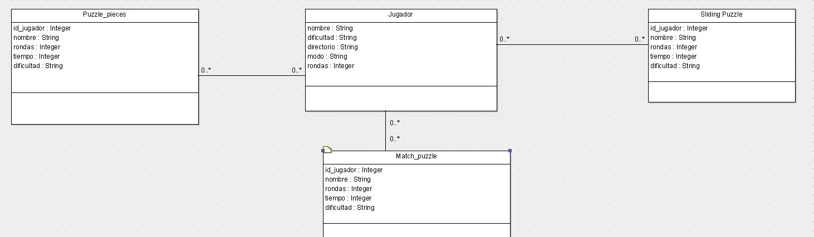

# Modelo E-R

La aplicación **PuzzleGames** utiliza un modelo que consta de tres tablas, cada una de ellas almacenará la puntuación de los jugadores para cada juego.

#### Tabla Puzzle_pieces

**Id del jugador**, campo autogenerado e incremental.

**Nombre**, donde se almacenará el nombre o alias del jugador.

**Rondas**, almacenará el número de rondas que ha elegido el jugador.

**Tiempo**, almacenará el tiempo restante, en el que el jugador ha resuelto el puzzle.

#### Tabla Match_Puzzle

**Id del jugador**, campo autogenerado e incremental.

**Nombre**, donde se almacenará el nombre o alias del jugador.

**Rondas**, almacenará el número de rondas que ha elegido el jugador.

**Tiempo**, almacenará el tiempo restante, en el que el jugador ha resuelto el puzzle.

#### Tabla Sliding Puzzle

**Id del jugador**, campo autogenerado e incremental.

**Nombre**, donde se almacenará el nombre o alias del jugador.

**Rondas**, almacenará el número de rondas que ha elegido el jugador.

**Tiempo**, almacenará el tiempo restante, en el que el jugador ha resuelto el puzzle.

